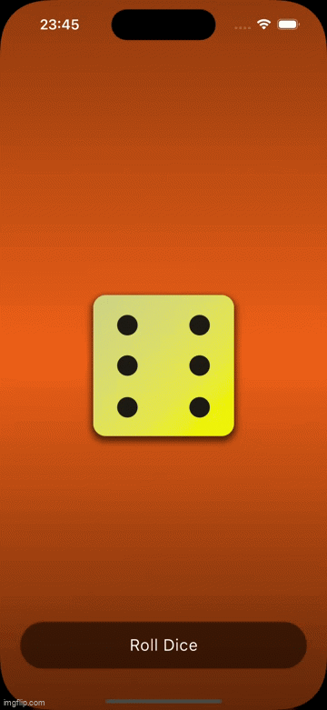

# Dice Rolling Flutter App

The app allows you to roll one dice and display the results on the screen.

## Features

- Press the "Roll" button to roll two dice.
- The app generates random numbers for each dice roll.
- The total sum of the dice values is displayed on the screen.

## Usage example

